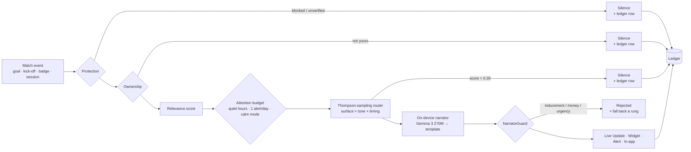

# Ambient

**A betting app that is paid to stay quiet.**

A native Android replica of [PSK](https://www.psk.hr), FEG's Croatian sportsbook — plus *Ambient*, a moment engine that decides when the app is allowed to interrupt you, writes the words itself on an on-device LLM, and records why it made every choice.

Built for a 24-hour FEG hackathon.

> Most engagement engines in this industry optimise for one thing: getting you back into the app. This one optimises for being right about when that is worth doing — and it is rewarded when it decides the answer is *never*.

---

## The argument

Every competitor's notification stack answers one question: *how do we get them to open the app?* That question has an obvious best answer — send more, say "don't miss out", time it for when they are losing — and the whole industry has found it.

Ambient answers a different one: **is this moment worth a customer's attention?** Most of the time it is not, and the engine says so out loud. Every decision to stay silent is written to a ledger with its reasons, and the router is *rewarded* when the customer comes back on their own after a stretch of quiet.

That single inversion is what the rest of this repository is about.

---

## How a moment travels

Nothing reaches a screen without passing through all of it. There is one door — `AmbientEngine.onEvent` — and no surface can be posted around it.



**Every exit writes a row, including the exits that render nothing.** "Most events produce nothing, and the ledger says why for each one" is a claim the demo makes out loud, so silence is recorded as deliberately as speech.

---

## Compliance is in the type system, not the code review

Four rules that cannot be broken by writing ordinary code. This is the technique the project leans on hardest: if a rule *can* be violated by a plausible edit, the model is wrong.

| Rule | How it is enforced |
|---|---|
| **No surface ever shows money** | `MomentFacts` has no field for a stake, an odd, a balance or a payout. A template cannot print one because there is nothing to print. |
| **No mission can require a wager** | `MissionType` has no `PLACE_BETS` case and `Mission` has no amount field. *"Place five bets"* cannot be written down. |
| **No reward is gambling credit** | `PerkCategory` has no `FREE_BET`, `BONUS`, `CASHBACK` or `ODDS_BOOST`. Every perk is redeemable by someone who has self-excluded — that is the test. |
| **No randomised rewards** | `Perk` carries a stated cost and stock and nothing resembling a probability. A mystery box has no field to live in. |

Adding any of them means editing an enum — a decision that shows up in a diff and gets argued about, rather than a line of JSON nobody reviews.

On top of that, **`NarratorGuard`** rejects every generated line that contains inducement (*"bet now"*, *"don't miss out"*, *"last chance"*), currency, two-decimal figures, or urgency (*"expires soon"*, *"hurry"*, *"požuri"*, *"istječe"*) — in English **and** Croatian. All **96** narrator combinations (12 moment types × 4 tones × 2 languages) are asserted against it in CI.

---

## What it does

### 🎙 Writes its own words, on the device

A three-rung ladder: **LiteRT-LM + Gemma 3 270M** → **Gemini Nano** → **templates**. Nothing leaves the phone. Every line is checked by `NarratorGuard` before it is shown, and if the model's output fails, the app falls to the next rung and says so — the "written by" badge on screen is never a lie.

Four tones (`PLAIN`, `WITTY`, `STATS`, `ONE_LINER`) in English and Croatian, with real Croatian noun agreement (`jednu značku` / `dvije značke` / `pet znački`) rather than a number glued to a singular.

### 📱 Five home-screen widgets, one lock-screen card

Android 16 **Live Updates** (a promoted, progress-styled lock-screen card for a slip in flight) and five Glance widgets — Live slip, My club, While you were away, My season, My protection — each with its own picker preview so they are distinguishable before they are placed.

### 🧠 A router that actually learns

Thompson sampling over `surface × tone × timing`, per context bucket. It learns from **four** signals, all wired end to end:

| Signal | Reward |
|---|---|
| Notification opened | `+1.00`, or `+0.50` if opened late |
| Notification swiped away | `−0.30` late … `−1.00` within two seconds |
| Thumbs on the widget | `±1.50` |
| **App opened unprompted after silence** | `+0.50` — *the silence was right* |

That last row is the one that makes the pitch true rather than decorative. **How it learns** in the app menu shows the gestures themselves and the Beta counters they moved.

### 🏅 Loyalty without the gambling

Missions, badges and tiers — with **"Set a deposit limit"** as a first-class mission worth three badges. Rewards are match tickets, merchandise, a stadium tour, a charity donation, a coffee voucher. Never a free bet.

> *Every competitor rewards you with a free bet. We reward you with a match ticket — and with a badge for setting a limit.*

### 🎰 The same engine, pointed at casino

The obvious way to extend an attention engine into casino is the wrong one. So the moment casino gets is the one a slot machine never volunteers: **how long you have been sitting there.** It runs the identical pipeline and is the one message exempt from the alert budget — a reality check is not marketing.

### 🛡 Protection outranks everything

`NORMAL` · `CALM` · `UNVERIFIED` · `BLOCKED`, derived from a synthetic exclusion register and the customer's own limits. Checked *before* relevance, again at the point of drawing, and it can take down a card that is already posted. Calm Mode pauses missions without erasing what was earned.

---

## Tech

| | |
|---|---|
| **Language** | Kotlin 2.2.0 |
| **UI** | Jetpack Compose · Material 3 · Compose BOM 2025.06.01 |
| **Widgets** | Glance 1.1.1 |
| **On-device LLM** | LiteRT-LM 0.16.1 · Gemma 3 270M (q8) |
| **Images** | Coil 3.2.0 |
| **Build** | AGP 8.11.1 · compileSdk 36 · minSdk 26 |
| **Architecture** | Single Activity · ViewModel + StateFlow · one hand-rolled `AppContainer`, no DI framework |
| **Size** | ~28,500 lines across 178 Kotlin files · 101 unit tests |

**No backend. No network calls. No API keys.** All data comes from `app/src/main/assets/mock/`.

---

## Getting started

```bash
git clone https://github.com/ashoksuthar14/FEGC_2.git
cd FEGC_2
./gradlew assembleDebug
adb install -r app/build/outputs/apk/debug/app-debug.apk
```

### The model is not in the repo

The 304 MB weights are deliberately excluded — not in the APK, not in git, in either the demo or in production. Without them the narrator falls back to templates and everything still works.

To enable the on-device LLM, download `gemma3-270m-it-q8.litertlm` (304 MB) from [`litert-community/gemma-3-270m-it`](https://huggingface.co/litert-community/gemma-3-270m-it) and push it:

```bash
adb push gemma3-270m-it-q8.litertlm \
  /sdcard/Android/data/eu.feg.ambient/files/models/
```

> ⚠️ `adb shell pm clear` and *Settings → Clear storage* both delete this file, because it lives in the app's external files directory. To reset app state without losing it:
> ```bash
> adb shell run-as eu.feg.ambient rm -f files/ambient_ledger.json files/ambient_loyalty.json
> ```

---

## Driving the demo

The engine is built to stay quiet, which is also why a judge might never see it do anything. Three ways to make it perform on cue.

**The bubble.** A debug-only button, bottom right. Two doors — *Match update* and *Mission to earn* — each sending a real notification through the real narrator. Press twice and you get two different sentences.

**Surface Lab.** `More → Surface Lab`. Goals, leg outcomes, Calm Mode, digests, recaps, missions, badges, reality checks.

**adb**, for driving it without touching the glass:

```bash
B="am broadcast -a eu.feg.ambient.DEMO_SURFACE \
  -n eu.feg.ambient/.ambient.surfaces.DemoSurfaceReceiver"

adb shell $B --es action stage       # place a slip, raise its surfaces
adb shell $B --es action goal        # a goal on that slip
adb shell $B --es action reality     # the casino reality check
adb shell $B --es action calm        # flip to Calm Mode
adb shell $B --es action away --ei minutes 150
adb shell $B --es action exclude --es on true
```

Deep links work too: `adb shell am start -n eu.feg.ambient/.MainActivity --es route missions`

---

## Layout

```
app/src/main/java/eu/feg/ambient/
├── ambient/              the Ambient engine — nothing here imports ui/
│   ├── engine/           pipeline, ledger, bandit router, protection
│   ├── narrator/         the ladder, four line tables, NarratorGuard
│   ├── surfaces/         Live Update, five Glance widgets, shortcuts
│   ├── loyalty/          missions, badges, perks   (N7)
│   ├── gaming/           casino session + reality check
│   ├── digest/           "while you were away"
│   ├── recap/            season recap, counts only
│   ├── identity/         club themes and crests
│   └── ticket/           retail slip scanning
├── core/                 AppContainer — the whole graph, by hand
├── data/                 mock repositories, models, match clock
└── ui/                   the PSK replica — never imports ambient/*
```

Two boundaries are load-bearing: **`data/` never imports `ui/`**, and the engine is a drop-in — Phase 1 was built so Phase 2 could be purely additive.

---

## Tests

```bash
./gradlew test
```

**101 tests.** The interesting ones assert claims rather than code:

- `LoyaltyCatalogueTest` — no mission can require a wager, no perk is gambling credit, *asserted against the enums* rather than the fixtures
- `FeedbackLearningTest` — a swipe moves the arm's losses and not its wins; a tap moves wins by exactly `RewardTable.TAP`; an unprompted open pays every recent silence
- `TemplateNarratorTest` — all 96 combinations clear `NarratorGuard`
- `UrgencyGuardTest` — urgency copy is rejected, while *"three days in a row"* and *"No hurry, and nothing expires"* still pass
- `EngineClaimsTest` / `EnginePipelineTest` — most events produce nothing, and every one leaves a row saying why
- `RecapNoMoneyTest`, `SurfaceProtectionTest`, `ContrastTest`

---

## What is real and what is not

Being straight about this matters more than the demo looking good.

**Real:** the moment engine, the bandit and its four feedback signals, the ledger, the protection state machine, `NarratorGuard`, the on-device LLM and its fallback ladder, Live Updates, all five widgets, the loyalty model and its compliance properties, the casino reality check.

**Simulated:** every fixture, odd and result (`assets/mock/*.json`, driven by a scripted match clock). The exclusion register is synthetic. Ticket scanning resolves against a mock lookup. **No game is playable and no real money exists anywhere in this app.**

**Known limits:** Croatian copy is model-checked, not native-checked. A Live Update swipe suppresses reposting but does not yet feed the router. Club colours are approximations, not licensed brand values, and no club badge is used.

---

## Licence & credit

A hackathon prototype, not a shipping product. PSK, FEG and the club names and colours belong to their owners and appear here as a design reference.

Built with [Claude Code](https://claude.com/claude-code).
