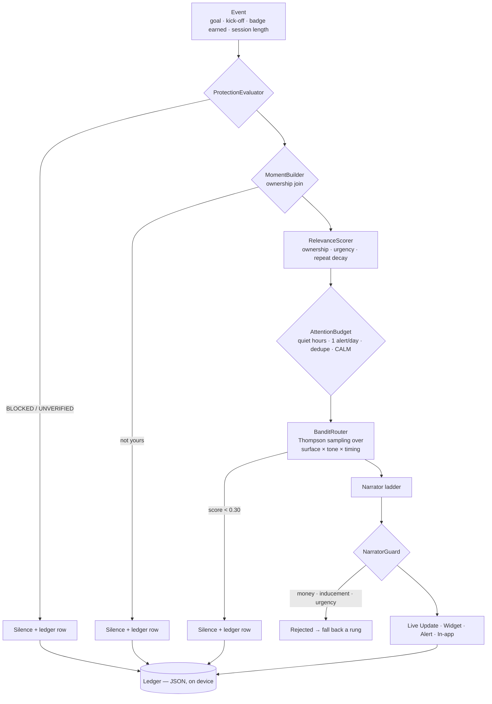

# Architecture

A native Android app in two halves: a replica of the PSK sportsbook, and *Ambient* — a moment engine that decides when the app is allowed to interrupt, writes the words on an on-device LLM, and records why it made every choice.

Phase 1 (the replica) was built so Phase 2 (the engine) could be **purely additive**. The two boundaries below are what make that true.

---

## 1. Repository layout, and a note on it

The FEG guide recommends top-level `src/` and `tests/`. This is a Gradle Android project, where those paths are fixed by the build system:

| FEG guide | This repository | Why |
|---|---|---|
| `src/` | **`app/src/main/`** | Android Gradle Plugin requires the module layout. Moving it breaks the build. |
| `tests/` | **`app/src/test/`** (JVM) and `app/src/androidTest/` | Same. `./gradlew test` runs them. |
| `assets/` | `app/src/main/assets/` | Packaged into the APK by the build system. |
| `config/` | `gradle/libs.versions.toml`, `app/build.gradle.kts` | Version catalogue and build configuration. No secret configuration exists. |

Everything else follows the guide. The deviation is a constraint of the platform, not a choice.

---

## 2. Module map

```
app/src/main/java/eu/feg/ambient/
├── ambient/            The Ambient engine. Never imports ui/.
│   ├── engine/         Pipeline, ledger, bandit router, protection evaluator
│   ├── narrator/       LLM ladder, four line tables, NarratorGuard
│   ├── surfaces/       Live Update, six Glance widgets, shortcuts, demo triggers
│   ├── loyalty/        Missions, badges, perks, tiers
│   ├── gaming/         Casino session tracking + reality check
│   ├── digest/         "While you were away"
│   ├── recap/          Season recap, counts only
│   ├── identity/       Club themes and generated crests
│   └── ticket/         Retail slip scanning and lookup
├── core/               AppContainer — the entire object graph, by hand
├── data/               Repositories, models, mock source, match clock
└── ui/                 The PSK replica. Screens, theme, navigation.
```

**Two boundaries are load-bearing:**

1. **`data/` never imports `ui/`.** Data has no idea a screen exists.
2. **`ambient/` never imports `ui/`.** The engine can be lifted out whole. (`ui/` *does* import `ambient/` — screens read engine state; the dependency runs one way only.)

There is **no DI framework**. `core/AppContainer.kt` constructs the graph explicitly. For a codebase this size that is a feature: the whole wiring is one readable file, and a reviewer can trace any dependency by reading it.

---

## 3. The pipeline — how a moment travels

There is **one door**, `AmbientEngine.onEvent(MatchEvent)`. No surface can be posted around it.



**Every exit writes a ledger row, including the ones that render nothing.** Silence is recorded as deliberately as speech — that is what makes "most events produce nothing, and the record says why" auditable rather than asserted.

### Components

| Component | File | Responsibility |
|---|---|---|
| `AmbientEngine` | `ambient/engine/AmbientEngine.kt` | The pipeline. The only entry point. |
| `DefaultProtectionEvaluator` | `ambient/engine/protection/` | Derives `NORMAL / CALM / UNVERIFIED / BLOCKED` from the exclusion register and the customer's own limits. Cached with a 15-minute window. |
| `DefaultMomentBuilder` | `ambient/engine/moment/` | Joins an event to what the customer owns. Returns null for events that are nobody's. |
| `DefaultRelevanceScorer` | `ambient/engine/moment/` | Score from ownership base + leg bonus + urgency, decayed for repeats. |
| `DefaultAttentionBudget` | `ambient/engine/moment/` | Which surfaces are open at all: quiet hours, alert budget, dedupe window, protection. |
| `BanditRouter` | `ambient/engine/router/` | Thompson sampling over arms, per context bucket. |
| `Ledger` | `ambient/engine/ledger/` | Append-only JSON record of every decision and every reward. |
| `TemplateNarrator` / ladder | `ambient/narrator/` | LiteRT-LM → Gemini Nano → templates. |
| `NarratorGuard` | `ambient/narrator/` | Rejects money, inducement and urgency, in English and Croatian. |
| `AndroidSurfaceController` | `ambient/surfaces/` | The only class that touches the notification manager or Glance. |

---

## 4. Data flow

```
assets/mock/*.json
   → MockDataSource (the only place data enters the app)
      → MatchRepository ── SystemMatchClock ticks ──▶ live scores, odds movement
      → BetRepository   ── betPlaced ──▶ SurfaceCoordinator ──▶ AmbientEngine
      → UserStateRepository (SharedPreferences) ──▶ ProtectionEvaluator
                                                └─▶ GameSessionTracker (reality check interval)
Ledger (filesDir/ambient_ledger.json)  ◀── every engine decision
LoyaltyStore (filesDir/ambient_loyalty.json) ◀── missions, badges, redemptions
WidgetStateStore (SharedPreferences) ◀── what the widgets draw
```

**Persistence is deliberately not Room.** Three JSON files behind `StateFlow`s and a handful of `SharedPreferences`. The `Ledger` is shaped like a DAO so it can become Room without changing its callers; adding Room for a hackathon prototype would have meant three dependencies and the KSP plugin for no reviewer-visible gain. This is documented in `LoyaltyStore.kt`.

**The match clock is a seam.** `data/clock/MatchClock` is an interface; `SystemMatchClock` ticks once a second and advances match minutes and scores. Everything downstream — live scores, the engine, session tracking — is driven by it, which is what makes the whole app demonstrable without a backend.

---

## 5. Surfaces

| Surface | Implementation | Notes |
|---|---|---|
| **Live Update** (lock screen) | `LiveUpdateRenderer` + `LiveSlipService` | Android 16 promoted ongoing notification with `ProgressStyle`. Foreground service. Carries a redacted `publicVersion` so a secure lock screen shows the score but never the slip. |
| **Six Glance widgets** | `ambient/surfaces/widget/` | Live slip, My club, While you were away, My season, My protection, and My club live (fully club-themed). Each has its own picker preview. |
| **Alerts** | `AndroidSurfaceController.postAlert` | Budget-capped at one per day, except the casino reality check, which is not marketing. |
| **Dynamic shortcuts** | `ambient/surfaces/shortcuts/` | Launcher long-press menu; the whole set changes under protection. |
| **In-app** | `ui/` | Widgets and screens reflect engine state. |

---

## 6. External dependencies and deployment assumptions

- **No backend, no network calls, no API keys.** There is no HTTP client in the dependency graph.
- **Two permissions:** `POST_NOTIFICATIONS`, `CAMERA` (slip scanning). Neither sends data anywhere.
- **One external artefact:** the Gemma 3 270M weights, ~304 MB, pushed to the device by the developer. Never in the repo or APK. Absent, the app falls back to templates and stays fully functional — see the README.
- **Target:** Android 16 (API 36) for Live Updates; `minSdk` 26. Live Updates degrade to ordinary ongoing notifications below Android 16.
- **Build:** Gradle wrapper included. `./gradlew assembleDebug` needs only a JDK 17+ and the Android SDK.

See [`dependencies.md`](dependencies.md) for the full licence disclosure and [`compliance-note.md`](compliance-note.md) for how the regulatory requirements are enforced in the type system.
